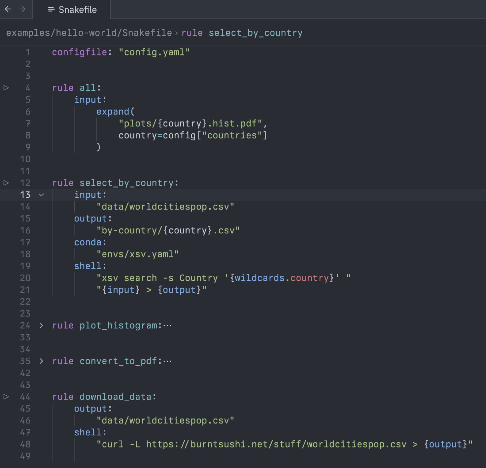

# zed-snakemake

A [Zed](https://zed.dev) extension for [snakemake](https://snakemake.readthedocs.io/en/stable/).

Provides language suport for Snakefiles:
syntax highlighting and outline, folds, tasks and runnables.

Can be installed from the Zed extension registry.

## Example

